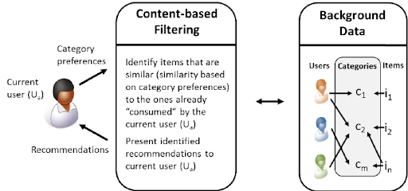
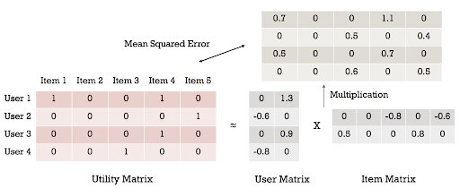
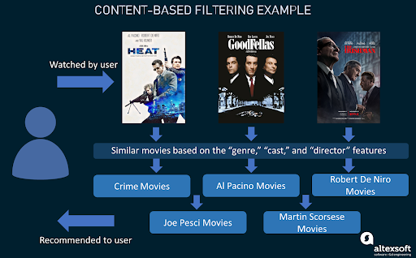
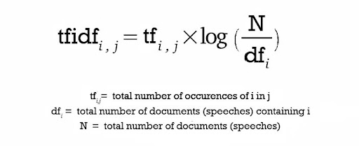
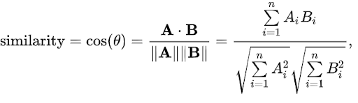
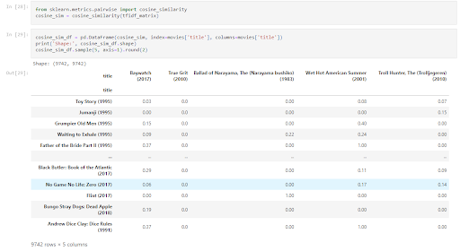

## Abstract
Every year new movies are released with a varied story-line or a genre which could be of potential interest to viewers. Various online movie or video streaming platforms can keep the customers engaged by recommending movies of the viewer's preference. A key research challenge for Recommender engines is makes more targeted recommendations. This paper presents Filtering approaches including Content-based, which recommends items (movies) to the user (viewer) based on their previous history/ preferences and Collaborative-based which uses opinions and actions of other similar users (viewers) to recommend items (movies). In Collaborative filtering, User-based, Item based, SVD, and SVD++ algorithms have been implemented and the performance evaluated. Finally, a hybrid recommendation engine that stacks both the Content-based and SVD filtering models is shown to have optimal performance and improved movie recommendations to retain active viewer engagement with the service.

## Introduction
In this hustling world, entertainment is a necessity for each one of us to refresh our mood and energy. Entertainment regains our confidence for work and we can work more enthusiastically. For revitalizing ourselves, we can listen to our preferred music or can watch movies of our choice. For watching favorable movies online, we can utilize movie recommendation systems, which are more reliable, since searching of preferred movies will require more and more time which one cannot afford to waste. In this paper, to improve the quality of a movie recommendation system, a Hybrid approach by combining content based filtering and collaborative filtering. Hybrid approach helps to get the advantages from both the approaches as well as tries to eliminate the drawbacks of both methods. What is a recommender system?
A recommender system is a filtration program whose aim is to provide the most relevant information to a user by discovering patterns in a dataset. The algorithm rates the items and shows the user the items that they would rate highly. An example of recommendation in action is when you visit amazon and you notice that some items are being recommended to you or when Netflix recommends certain movies to you. The domain-specific item is a movie; therefore, the main focus of our recommendation system is to filter and predict only those movies which a user would prefer given some data about the user him or herself. 
Different filtration strategies: 

   
   
###### 1. Content-Based Filtering  
This filtration strategy is based on the data provided about the items. The algorithm recommends products that are similar to the ones that a user has liked in the past. This similarity (generally cosine similarity) is computed from the data we have about the items as well as the user’s past preferences. For example, if a user likes movies such as ‘The Prestige’ then we can recommend him the movies of ‘Christian Bale’ or movies with the genre ‘Thriller’ or maybe even movies directed by ‘Christopher Nolan’. So, what happens here the recommendation system checks the past preferences of the user and find the film “The Prestige”, then tries to find similar movies to that using the information available in the database such as the lead actors, the director, genre of the film, production house, etc. and based on this information find movies similar to “The Prestige”.

###### 2. Collaborative Filtering  
This filtration strategy is based on the combination of the user’s behavior and comparing and contrasting that with another users’ behavior in the database. The history of all users plays an important role in this algorithm. The main difference between content-based filtering and collaborative filtering that in the latter, the interaction of all users with the items influences the recommendation algorithm while for content-based filtering only the concerned user’s data is considered. There are multiple ways to implement collaborative filtering but the main concept to be grasped is that in collaborative filtering multiple user’s data influences the outcome of the recommendation. and doesn’t depend on only one user’s data for modeling. There are 2 types of collaborative filtering algorithms:
• User-based Collaborative filtering  
The basic idea here is to find users that have similar past preference patterns as the user ‘A’ has had and then recommending him or her items liked by those similar users which ‘A’ has not encountered yet. This is achieved by making a matrix of items each user has rated/viewed/liked/clicked depending upon the task at hand, and then computing the similarity score between the users and finally recommending items that the concerned user isn’t aware of but users similar to him/her are and liked it. For example, if the user ‘A’ likes ‘Batman Begins’, ‘Justice League’ and ‘The Avengers’ while the user ‘B’ likes ‘Batman Begins’, ‘Justice League’ and ‘Thor’ then they have similar interests because we know that these movies belong to the super-hero genre. So, there is a high probability that the user ‘A’ would like ‘Thor’ and the user ‘B’ would like The Avengers’.
• Item-based Collaborative Filtering  
The concept in this case is to find similar movies instead of similar users and then recommending similar movies to that ‘A’ has had in his/her past preferences. This is executed by finding every pair of items that were rated/viewed/liked/clicked by the same user, then measuring the similarity of those rated/viewed/liked/clicked across all user who rated/viewed/liked/clicked both, and finally recommending them based on similarity scores. Here, for example, we take 2 movies ‘A’ and ‘B’ and check their ratings by all users who have rated both the movies and based on the similarity of these ratings, and based on this rating similarity by users who have rated both we find similar movies. So, if most common users have rated ‘A’ and ‘B’ both similarly and it is highly probable that ‘A’ and ‘B’ are similar, therefore if someone has watched and liked ‘A’ they should be recommended ‘B’ and vice versa. • Other algorithms: There are other approaches like market basket analysis, which works by looking for combinations of items that occur together frequently in transactions.

###### 3. Hybrid Recommendation System  
  
Recent research has demonstrated that a hybrid approach, combining collaborative filtering and content-based filtering could be more effective in some cases. Hybrid approaches can be implemented in several ways, by making content-based and collaborative-based predictions separately and then combining them, by adding content-based capabilities to a collaborative-based approach (and vice versa), or by unifying the approaches into one model. Netflix is a good example of the use of hybrid recommender systems. The website makes recommendations by comparing the watching and searching habits of similar users (i.e. collaborative filtering) as well as by offering movies that share characteristics with films that a user has rated highly (content-based filtering).

## Methods and Analysis

###### 1. Content Based Filtering  
This filtering is based on the description or some data provided for that product. The system finds the similarity between products based on its context or description. The user’s previous history is taken into account to find similar products the user may like.
For example, if a user likes movies such as ‘Mission Impossible’ then we can recommend to him the movies of ‘Tom Cruise’ or movies with the genre ‘Action’. 
In this filtering, two types of data are used. First, the likes of the user, the user’s interest, user’s personal information such as age or, sometimes the user’s history too. This data is represented by the user vector. Second, information related to the product’s known as an item vector. The item vector contains the features of all items based on which similarity between them can be calculated. 
The recommendations are calculated using cosine similarity.

###### Advantages of Using Content Based Filtering  
The user gets recommended the types of items they love.
The user is satisfied by the type of recommendation.
New items can be recommended; just data for that item is required.

###### Disadvantages of Using Content Based Filtering  
The user will never be recommended for different items.
Business cannot be expanded as the user does not try a different type of product.
If the user matrix or item matrix is changed the cosine similarity matrix needs to be calculated again.

 

###### Introduction to TF-IDF  
TF-IDF stands for “Term Frequency — Inverse Document Frequency”. This is a technique to quantify words in a set of documents. We generally compute a score for each word to signify its importance in the document and corpus. This method is a widely used technique in Information Retrieval and Text Mining. 
If I give you a sentence for example “This building is so tall”. It's easy for us to understand the sentence as we know the semantics of the words and the sentence. But how can any program (eg: python) interpret this sentence? It is easier for any programming language to understand textual data in the form of numerical value. So, for this reason, we need to vectorize all of the text so that it is better represented. 
By vectorizing the documents we can further perform multiple tasks such as finding the relevant documents, ranking, clustering, etc. This exact technique is used when you perform a google search (now they are updated to newer transformer techniques). The web pages are called documents and the search text with which you search is called a query. The search engine maintains a fixed representation of all the documents. When you search with a query, the search engine will find the relevance of the query with all of the documents, ranks them in the order of relevance and shows you the top k documents. All of this process is done using the vectorized form of query and documents. 

Now coming back to our TF-IDF,
TF-IDF = Term Frequency (TF) * Inverse Document Frequency (IDF)
Terminology
t — term (word)
d — document (set of words)
N — count of corpus
corpus — the total document set
 

 
Content based method similarity calculation

###### Advantages of Using TF-IDF  
The biggest advantages of TF-IDF come from how simple and easy to use it is. It is simple to calculate, it is computationally cheap, and it is a simple starting point for similarity calculations (via TF-IDF vectorization + cosine similarity).
 

###### Disadvantages of Using TF-IDF  
1.)Something to be aware of is that TF-IDF cannot help carry semantic meaning. It considers the importance of the words due to how it weighs them, but it cannot necessarily derive the contexts of the words and understand importance that way. 
2.)Also as mentioned above, like BoW, TF-IDF ignores word order and thus compound nouns like “Queen of England” will not be considered as a “single unit”. This also extends to situations like negation with “not pay the bill” vs “pay the bill”, where the order makes a big difference. In both cases using NER tools and underscores, “queen_of_england” or “not_pay” are ways to handle treating the phrase as a single unit. 

Let’s implement this on our problem statement-

 

###### Step- 1 : Data Preparation  
Let's load this data into Python. I will load the dataset with Pandas onto Dataframes ratings, users, and movies. Before that, I'll also pass in column names for each CSV and read them using pandas (the column names are available in the Readme file).
.JPG) 
 

###### Step- 2 : Data Exploration  
As we'll explore in the next section, the genres alone can be used to provide a reasonably good content based recommendation. But before that, we need to analyse some important aspects.

.JPG)

.JPG)
 

###### Step- 3 : Data Insights: 'Genres'  
As we'll explore in the next section, the genres alone can be used to provide a reasonably good content based recommendation. But before that, we need to analyse some important aspects. 
Which are the most popular genres?
This will be a relevant aspect to take into account when building the content based recommender. We want to understand which genres really are relevant when it comes to defining a user's taste. A reasonable assumption is that it is precisely the unpopular genres, that will be more relevant in characterising the user's taste.
The most relevant genres are: 
.JPG)
 

###### Step- 4 : Building a Content Based Recommender  
For the post, we will be building a fairly simple recommender, based on the movie genres. A fairly common approach is to use a tf-idf vectorizer. 
While this approach is more commonly used on a text corpus, it possesses some interesting properties that will be useful in order to obtain a vector representation of the data. The expression is defined as follows:

 

Where we have the product of the term frequency, i.e. the amount of times a given term (genre) occurs in a document (genres of a movie), times the right side factor, which basically scales the term frequency depending on the amount of times a given term appears in all documents (movies).
The lesser the amount of movies that contain a given genre (df_i), the higher the resulting weight. The logarithm is basically to smoothen the result of the division, i.e. avoids huge differences as a result of the right hand term.
So why is this useful in our case?
As already mentioned, tf-idf will help capture the important genres of each movie by giving a higher weight to the less frequent genres, which we wouldn't get with say, CountVectorizer .
tf-idf
To obtain the tf-idf vectors I'll be using sklearn's TfidfVectorizer . However, we have to take into account some aspects particular to this problem. The usual setup when dealing with text data, is to set a word analyzer and perhaps an ngram_range , which will also include the n-grams within the specified range. An example would be:

###### Step- 5 : Similarity between Vectors  
The next step will be to find similar vectors (movies). Recall that we've encoded each movie's genre into its tf-idf representation, now we want to define a proximity measure. A commonly used measure is the cosine similarity. 
This similarity measure owns its name to the fact that it equals to the cosine of the angle between the two vectors being compared. The lower the angle between two vectors, the higher the cosine will be, hence yielding a higher similarity factor. It is expressed as follows (source):

 
 
Where, since the inner product can be expressed as the product of the magnitudes times the cosing of the angle between the two vectors, it becomes clear that the above can be expressed as the cosine source:
 
So here we'll be obtaining the cosine by taking the inner product between both vectors, and normalising by their respective magnitudes. 
To compute the cosine similarities between all tf-idf vectors, we can again use scikit-learn. sklearn.metrics.pairwise contains many pairwise distance metrics, among them cosine_similarity, which will compute the cosine similarities between all the input rows, in this case tf-idf vectors:

 

###### Step- 6 : Testing the Recommender 
.JPG)

.JPG)

###### 2.1. Item Item Based Collaborative Filtering
Item-based collaborative filtering is a recommendation system that uses item similarity and user ratings to make recommendations. This method is based on the idea that users give similar ratings to similar items. To develop an efficient recommender system, many methods are being investigated. Because it is domain-free, the Collaborative Filtering (CF) recommender system beats the Content-based recommender system. Item-based CF (IBCF) is a well-known technique in the field of CF that gives accurate suggestions and has been employed by applications that provide product recommendation systems. In this section we explain the implementation of Item-based Collaborative Filtering using Python to build a movie recommendation system.

As shown in the figure above, The similarities between movies are calculated first. Second, movies similar to those already rated are examined and recommended based on the computed similarities.
Item based collaborative Filtering models are developed using machine learning algorithms to predict movies for one user. Here we use KNN Model. The k-nearest neighbors (KNN) approach relies on item feature similarity rather than making any assumptions about the underlying data distribution. When a KNN predicts a movie, it calculates the 'distance' between the target movie and all other movies in its database. The top 'k' nearest neighbor movies (with the shortest distance measure) are then returned as the most similar movie choices.
Lets move to the implementation of the Item-based Collaborative Filtering using Python.

###### 2.1.1 Implementation with KNN and KNNWith Means Model for Prediction of 10 Movies
The dataset we have used is https://files.grouplens.org/datasets/movielens/ml-latest-small.zip. It contains 100836 ratings and 3683 tag applications across 9742 movies. These data were created by 610 users between March 29, 1996 and September 24, 2018. This dataset was generated on September 26, 2018.

All the necessary libraries are imported at the beginning for simplicity. 
As we'll be coding in Google Colab, we'll need to upload the movies and ratings csv files first. Once the file is uploaded we read the file contents using Pandas.

###### Data Preprocessing
The 'rating' file contains ratings given by users to the movies. Seaborn is used to visualize the number of ratings provided by different users for different ratings. 

The ‘movies’ file contains the movie's id, title, and genres. Based on the movieId, both the movies and ratings are combined. The movies are then grouped and the total rating count for each is calculated. This will aid in comprehending the dispersion of movie ratings. There are many movies with only one rating provided by the user. We are filtering the movies in such a way that movies with minimum 3 ratings are only considered. Similarly, we group the users in such a way that those rated greater than or equal to 50.

KNN collaborative filtering algorithm, is a combination of both collaborative filtering algorithm and KNN algorithm.
We want the data for K-Nearest Neighbors to be in an array, with each row representing a movie and each column representing a separate user. We'll pivot the data frame to a wide format with movies as rows and users as columns to reshape it. Since we'll be conducting linear algebra operations for calculating distances between vectors, we'll fill in the missing observations with 0s . Finally, we convert the dataframe's values into a scipy sparse matrix for faster calculations.

The KNN algorithm is used to select the neighbors. In this project we use k value to be 10. Ten movies which are similar in distance with the input movie by the user are calculated and recommended to the user.

COSINE COMPUTING
Here we use cosine similarity, a method that computes the closeness between two movies by figuring the cosine of the point between the two vectors

where Ai and Bi are parts of vectors A and B respectively.
The subsequent closeness ranges from −1 meaning precisely inverse, to 1 meaning precisely the equivalent, with 0 demonstrating symmetry or decorrelation, while in the middle qualities show halfway similarity or uniqueness. For content coordinating, the characteristic vectors A and B are generally the term recurrence vectors of the reports. Cosine closeness can be viewed as a technique for normalizing document length during comparison.
We calculate cosine similarity between the input movie and the other movies.
KNN NEAREST NEIGHBOR SELECTION
After the calculation of similarity as Similarity between movies, then the algorithm selects a number of movies that are nearest to the input movie. Here, the KNN model selects 10 movies that are similar to the input movie. Select just the 10  high similitudes as neighbors. As shown in figure below.

To test the model, we gave a sample input of  'Toy story' to see if our model gives 10 recommendations. The figure below shows the output of our implementation.

Thus our KNN model successfully recommended 10 movies that were similar to the input movie.

RMSE SCORE
The root mean squared error, or RMSE, is the most used statistic for measuring the performance of a prediction model. The primary concept is to compare the model's predictions to actual observed data to see how bad/wrong they are. As a result, a high RMSE is "bad," whereas a low RMSE is "excellent."
Surprise is a Python scikit for creating and evaluating recommender systems using explicit rating data. It provides tools for evaluating, analyzing, and comparing the performance of algorithms. The surprise package has many builtin methods. One Of that is RMSE. For the movie recommendation system that we have built, we are calculating the RMSE score to see the effectiveness of the model.
We import, Reader, Dataset and cross_validate functions to perform this. We split the dataset into train and test data. Since we have used the KNN model, we need to import the KNNBasic and compute the RMSE. The RMSE score for KNN Model is shown in the figure below.

KNNWithMeans is a basic collaborative filtering algorithm that considers each user's mean ratings. The RMSE score for KNN Model is shown in the figure below.

###### Disadvantages of Item Based Collaborative filtering
###### Cold Start
The dot product of the associated embeddings represents the model's forecast for a given movie pair. As a result, if an item isn't observed during training, the system won't be able to construct an embedding for it or query the model with it. This problem is known as the cold-start problem.
###### Hard to include side features for query/item
Any features not related to the query or item ID are referred to as side features. Side features for movie recommendations could include country or age. The model's quality is improved by including available side features. 

###### 2.1.2 What is SVD in Collaborative Filtering
  
The Singular Value Decomposition (SVD), a method from linear algebra that has been generally used as a dimensionality reduction technique in machine learning. SVD is a matrix factorization technique, which reduces the number of features of a dataset by reducing the space dimension from N-dimension to K-dimension (where K<N). In the context of the recommender system, the SVD is used as a collaborative filtering technique. It uses a matrix structure where each row represents a user, and each column represents an item. The elements of this matrix are the ratings that are given to items by users.

The factorization of this matrix is done by the singular value decomposition. It finds factors of matrices from the factorization of a high-level (user-item-rating) matrix. The singular value decomposition is a method of decomposing a matrix into three other matrices as given below: Where A is a m x n utility matrix, U is a m x r orthogonal left singular matrix, which represents the relationship between users and latent factors, S is a r x r diagonal matrix, which describes the strength of each latent factor and V is a r x n diagonal right singular matrix, which indicates the similarity between items and latent factors. The latent factors here are the characteristics of the items, for example, the genre of the music. The SVD decreases the dimension of the utility matrix A by extracting its latent factors. It maps each user and each item into a r-dimensional latent space. This mapping facilitates a clear representation of relationships between users and items. 

Let each item be represented by a vector xi and each user is represented by a vector yu. The expected rating by a user on an item   can be given as: Here,   is a form of factorization in singular value decomposition. The xi and yu can be obtained in a manner that the square error difference between their dot product and the expected rating in the user-item matrix is minimum. It can be expressed as: In order to let the model, generalize well and not overfit the training data, a regularization term is added as a penalty to the above formula. In order to reduce the error between the value predicted by the model and the actual value, the algorithm uses a bias term. Let for a user-item pair (u, i), μ is the average rating of all items, bi is the average rating of item i minus μ and bu is the average rating given by user u minus μ, the final equation after adding the regularization term and bias can be given as:
The above equation is the main component of the algorithm which works for singular value decomposition-based recommendation system.

###### 2.1.3 What is SVD++ in Collaborative Filtering 
The “user-item” rating matrix is the core data used by the recommender system. MF is a good method of predicting the missing ratings in collaborative filtering. In brief, MF involves factorizing a sparse matrix and finding two latent factor matrices: the first is the user matrix to indicate the user’s features (i.e., the degree of preference of a user for each factor) and the other is the item matrix, which indicates the item’s features (i.e., the weight of an item for each factor). The missing ratings are then predicted from the inner product of these two factor matrices. Let 𝑅𝑛×𝑚 be a rating matrix containing the ratings of 𝑛 users for 𝑚 items. Each matrix element 𝑟𝑢𝑖 refers to the rating of user 𝑢for item 𝑖. Given a lower dimension𝑑, MF factorizes the raw matrix𝑅𝑛×𝑚 into two latent factor matrices: one is the user-factor matrix𝑃𝑛×𝑑 and the other is the item-factor matrix 𝑄𝑑×𝑚. The factorization is done such that 𝑅 is approximated as the inner product of 𝑃and𝑄(i.e., ̃𝑅𝑛×𝑚 =𝑃𝑛×𝑑×𝑄𝑑×𝑚),and each observed rating 𝑟𝑢𝑖 is approximated by ̃𝑟𝑢𝑖 =𝑞𝑇 𝑖⋅𝑝𝑢 (also called the predicted value). However, 𝑞𝑇 𝑖 ⋅𝑝𝑢 only captures the relationship between the user 𝑢 and the item 𝑖. In the real world, the observed rating may be affected by the preference of the user or the characteristics of the item. In other words, the relationship between the user 𝑢 and the item 𝑖 can be replaced by the bias information. For instance, suppose one wants to predict the rating of the movie “Batman” by the user “Tom.” Now, the average rating of all movies on one website is 3.5, and Tom tends to give a rating that is 0.3 lower than the average because he is a critical man. The movie “Batman” is better than the average movie, so it tends to be rated 0.2 above the average. Therefore, considering the user and movie bias information, by performing the calculation 3.5 − 0.3 + 0.2 = 3.4, it is predicted that Tom will give the movie “Batman” a rating of 3.4. The user and item bias information can reflect the truth of the rating more objectively. SVD is a typical factorization technology (known as a baseline predictor in some works in the literature). Thus, the predicted rating is changed to

where𝜇 is the overall average rating and 𝑏𝑢 and 𝑏𝑖 indicate the observed deviations of user 𝑢 and item 𝑖, respectively. 
The goal of a recommender system is to improve the predictive accuracy. In fact, the user will leave some implicit feedback information, such as historical browsing data, and historical rating data, on Web applications as long as any user has rated item 𝑖, no matter what the specific rating value is. To a certain extent, the rating operation already reflects the degree of a user’s preference for each latent factor. Therefore, the SVD++ model introduces the implicit feedback information based on SVD; that is, it adds a factor vector (𝑦𝑗 ∈𝑅𝑓) for each item, and these item factors are used to describe the characteristics of the item, regardless of whether it has been evaluated. Then, the user’s factor matrix is modelled, so that a better user bias can be obtained. Thus, the predictive rating of the SVD++ model is  

where 𝑅(𝑢) is the number of items rated by user 𝑢. 
To obtain the optimal 𝑃 and 𝑄, the regularized squared error can be minimized as follows. The objective function of the SVD++model is 

where 𝜆 is the regularization parameter to regularize the factors and prevent overfitting. 

###### 2.1.4 Disadvantages of Item Based Collaborative filtering
###### Cold Start
The dot product of the associated embeddings represents the model's forecast for a given movie pair. As a result, if an item isn't observed during training, the system won't be able to construct an embedding for it or query the model with it. This problem is known as the cold-start problem.
###### Hard to include side features for query/item
Any features not related to the query or item ID are referred to as side features. Side features for movie recommendations could include country or age. The model's quality is improved by including available side features. 

###### 2.2 User-Based Collaborative Filtering  
Collaborative Filtering is a technique which is widely used in recommendation systems and is rapidly advancing research area. The two most commonly used methods are memory-based and model-based.
An example of collaborative filtering can be to predict the rating of a particular user based on user ratings for other movies and others’ ratings for all movies. This concept is widely used in recommending movies, news, applications, and so many other items. Let’s assume I have user U1, who likes movies m1, m2, m4. user U2 who likes movies m1, m3, m4, and user U3 who likes movie m1.

We did not implement user-user based collaborative filtering as it takes a lot of time in computation with large number of users.

###### 3. Hybrid Recommendation System
As discussed above, there are two approaches for a recommender system which are 
1. Content-based recommendation system: Content-based approach recommends movies which are similar to the searched movie. It checks the genre of the searched movie and finds movies similar to the genre of the searched movie. The similarity is calculated using cosine distance and the top N closest movies are recommended.
Main disdavantage of content-based system: It put a great deal of importance on the movie information than personalizing it to the user. So as a result, if user 1 and user 2 search for a movie 'A', they get the same recommendations. It is not tailored to the user's preference.  
2. Collaborative-based recommendation system: Collaborative-based approach takes into account the ratings given by particular user to a particular movie and then recommends movies which are similar to user's interests. But the the problem with this approach is that it needs to have a knowledge about user's preference beforehand. This approach suffers from cold start problem. When there is a new movie who has not rated any movie or when there is a new movie which was not rated by any user, this algorithm cannot recommend movies suitable as it doesn't have the required information.  
Thus, a lot of recommendation systems take the hybrid aproach. Here, we implemented a hybrid method which works as described below. 
1. When there is a new user, he/she gets the most popular movies recommended if he doesn't search for any movie. If the user searches for a movie, we use content-based approach to recommend movies similar to the movie searched.
2. When there is an already existing user but is inactive i.e. he/she did not rate many movies (<50 ratings), then we use collaborative filtering using SVD algorithm to recommend a movie.  
3. When the existing user is an active user who rated more than 50 movies, we use collaborative filtering using SVD++ to give recommendations.  
Below figure shows the flow of the hybrid method.

###### 3.1 Choice of collaborative algorithm
We implemented four algorithms for collaborative filtering which are KNN, KNN With Means, SVD and SVD++. To measure the methods, we used the evaluation metric RMSE. RMSE is calculated as seen below:  
Out of the four, SVD++ has the least RMSE. So it is an ideal choice for collaborative filtering. But, the algorithm takes a lot of time to execute which delays the recommendation process. So we divided the users into two groups - active user and inactive users. 
Below figures show the RMSE and time taken for the four algorithms
For KNN

For KNN Means

For SVD

For SVD++

The time shown in the above pictures is in seconds. we can see that SVD++ takes a considerably longer time to run than the others.
So we are recommending movies using SVD++ algorithm for active users and SVD algorithm which is the second best method of the four for the inactive users. 
###### 3.2 Division of users
When we plot a graph to show the distribution of ratings, we see that a lot of users have given less than 50 ratings. Below is the ratings distribution plot.  

We can see that a lot of users fall in the 20-80 ratings. Since SVD++ was taking considerably more time which is perceivable than the other algorithms, we decided to use different algorithms for different set of users. We use SVD which has almost similar RMSE as SVD++ for inactive users so that the recommendation is given in less time.

###### Conclusion
To conclude, A hybrid recommendation system is a special type of recommendation system which can be considered as the combination of the content and collaborative filtering method. Combining collaborative and content-based filtering together may help in overcoming the shortcoming we are facing at using them separately like cold start problem and also can be more effective in some cases. Hybrid recommender system approaches can be implemented in various ways like by using content and collaborative-based methods to generate predictions separately and then combining the prediction or we can just add the capabilities of collaborative-based methods to a content-based approach (and vice versa). There are several studies that compare the performance of the conventional approaches with the hybrid methods and say that by using the hybrid methods we can generate more accurate recommendations. 
We can clearly see that a Hybrid Recommendation System performs better even on our dataset - ‘movies dataset’ wherein we are accurately able to recommend top 10 movies to the end user. The model's accuracy is significantly higher in this case and the predicted results are closer to the expected one’s.

 

